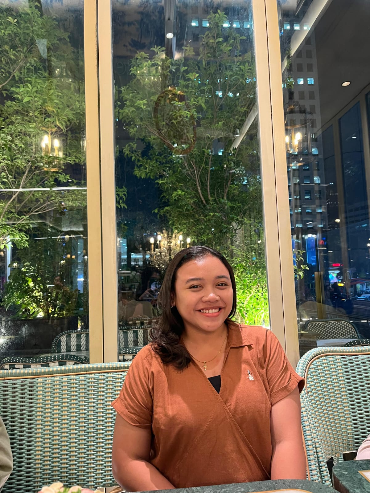

# 🎨 Panduan Customization - MyBirthday

Panduan lengkap untuk customize website undangan Anda sesuai kebutuhan.

## 🖼️ Mengubah Foto Utama

### Step 1: Persiapkan Foto Anda
- Foto sebaiknya landscape (lebar > tinggi) 
- Ukuran minimal: 400x300px
- Format: JPG, PNG, atau WebP
- Ukuran file: kurang dari 2MB untuk loading cepat

### Step 2: Letakkan di Folder yang Sama
```
REQ ROSA/
├── index.html
├── ROSARI.jpeg ← letakkan foto di sini
└── README.md
```

### Step 3: Update File HTML
Buka `index.html` dan cari baris ini (sekitar line 150):
```html

```

Ubah `ROSARI.jpeg` menjadi nama file Anda:
```html

```

---

## 👤 Mengubah Nama & Teks

Buka `index.html` di text editor dan cari teks berikut:

### Landing Page Text
```html
<!-- Di dalam section.landing -->
<div class="header-text">Undangan Istimewa</div>
<p class="subtext">untuk Anda</p>
```

Ubah menjadi:
```html
<div class="header-text">Selamat Datang</div>
<p class="subtext">di acara spesial</p>
```

### Invitation Page - Heading
```html
<div class="title">🎂 Pesta Ulang Tahun ke-24 🎂</div>
```

Ubah "ke-24" dengan umur sesuai acara.

### Invitation Page - Subtitle
```html
<div class="subtitle">Mari rayakan hari spesial bersama Maria Rosari Prasetraningrum dengan penuh kebahagiaan dan kehangatan 💖</div>
```

Ubah nama "Maria Rosari Prasetraningrum" dengan nama punya Anda.

---

## 📅 Mengubah Tanggal & Waktu Acara

Buka `index.html` dan cari bagian JavaScript (sekitar line 200):

```javascript
const eventDate = new Date(2026, 9, 11, 11, 0, 0);
```

Format: `new Date(tahun, bulan-1, tanggal, jam, menit, detik)`

### Contoh Penggunaan:

**1. Acara 25 Desember 2026 jam 14:00**
```javascript
const eventDate = new Date(2026, 11, 25, 14, 0, 0);
// 11 = Desember (Desember - 1)
```

**2. Acara 1 Januari 2027 jam 09:30**
```javascript
const eventDate = new Date(2027, 0, 1, 9, 30, 0);
// 0 = Januari
```

**Referensi Bulan:**
```
0 = Januari    7 = Agustus
1 = Februari   8 = September
2 = Maret      9 = Oktober
3 = April     10 = November
4 = Mei       11 = Desember
5 = Juni
6 = Juli
```

---

## 📍 Mengubah Lokasi & Google Maps

### Update Teks Lokasi
Cari:
```html
<p><strong>Bekasi, Jawa Barat</strong></p>
```

Ubah dengan lokasi Anda:
```html
<p><strong>Jakarta, Indonesia</strong></p>
```

### Update Link Google Maps
1. Buka Google Maps
2. Temukan lokasi acara Anda
3. Klik tombol "Share" → "Copy link"
4. Paste link di `index.html`:

```html
<a id="mapsLink" href="https://maps.app.goo.gl/YOUR-LINK-HERE" target="_blank">
```

Contoh hasil akhir:
```html
<a id="mapsLink" href="https://maps.app.goo.gl/abc123xyz" target="_blank">
```

---

## 💬 Mengubah Nomor WhatsApp

Buka `index.html` dan cari:
```javascript
const whatsappNumber = "6281703023620";
```

Ubah dengan nomor Anda (format internasional):

**Contoh:**
```javascript
// Indonesia
const whatsappNumber = "6281234567890";  // 0812-345-67890

// Luar negeri
const whatsappNumber = "12125551234";    // +1 (212) 555-1234
```

### Format Nomor:
- Tidak perlu tanda `+`
- Tidak perlu tanda `-` atau spasi
- Hanya angka saja
- Mulai dengan country code (62 untuk Indonesia)

---

## 🎨 Mengubah Warna

### Opsi 1: Mengubah CSS Variables (Mudah)

Buka `index.html` dan cari bagian `:root` di awal `<style>`:

```css
:root{
  --primary:#e255a1;        /* Warna utama - pink */
  --secondary:#ff6b9d;      /* Warna sekunder */
  --tertiary:#ffa5c7;       /* Warna tersier */
  --accent:#f093fb;         /* Warna accent - ungu */
}
```

**Palet Warna Preset untuk Acara:**

**Wedding (Pernikahan):**
```css
:root{
  --primary:#d4a5a5;        /* Rose gold */
  --secondary:#c18b7b;
  --tertiary:#e8d4c8;
  --accent:#a78376;
}
```

**Birthday (Ulang Tahun Ceria):**
```css
:root{
  --primary:#ff6b9d;        /* Pink bright */
  --secondary:#ffa726;      /* Orange */
  --tertiary:#42a5f5;       /* Blue */
  --accent:#ab47bc;         /* Purple */
}
```

**Elegant (Elegan):**
```css
:root{
  --primary:#1e3a8a;        /* Dark blue */
  --secondary:#0f766e;      /* Teal */
  --tertiary:#7c2d12;       /* Brown */
  --accent:#4f46e5;         /* Indigo */
}
```

**Fun & Colorful (Ceria):**
```css
:root{
  --primary:#ec4899;        /* Pink */
  --secondary:#f97316;      /* Orange */
  --tertiary:#06b6d4;       /* Cyan */
  --accent:#8b5cf6;         /* Violet */
}
```

### Opsi 2: Menggunakan Hex Color Picker
- Buka https://htmlcolorcodes.com/
- Pilih warna yang Anda suka
- Copy hex code
- Paste di CSS variables

---

## 🎵 Mengubah Background Music

### Step 1: Siapkan File Audio
- Format: MP3 atau WAV
- Durasi: 2-5 menit (untuk loop)
- Ukuran: kurang dari 5MB

### Step 2: Letakkan di Folder
```
REQ ROSA/
├── index.html
├── lagu-ulang-tahun.mp3 ← letakkan di sini
└── README.md
```

### Step 3: Update HTML
Cari:
```html
<audio id="bgMusic" loop preload="auto">
  <source src="american-authors-best-day-of-my-life-single-version.mp3" type="audio/mpeg">
</audio>
```

Ubah nama file:
```html
<audio id="bgMusic" loop preload="auto">
  <source src="lagu-ulang-tahun.mp3" type="audio/mpeg">
</audio>
```

---

## 🔤 Mengubah Font

### Fonts yang Tersedia (dari Google Fonts):
- **Playfair Display** - untuk heading (elegan)
- **Poppins** - untuk body text (modern)

### Mengubah ke Font Lain:

1. Buka https://fonts.google.com/
2. Cari font yang Anda suka
3. Copy kode import
4. Ganti di `index.html` bagian head:

```html
<!-- Contoh: menggunakan Montserrat untuk heading -->
@import url('https://fonts.googleapis.com/css2?family=Montserrat:wght@700;800&family=Poppins:wght@300;400;600;700&display=swap');
```

5. Update CSS untuk heading:
```css
.header-text{
  font-family:'Montserrat',sans-serif;  /* Ubah dari Playfair Display */
}
```

---

## 🎊 Mengubah Jumlah Confetti

Buka `index.html` dan cari function `createConfetti()`:

```javascript
for(let i=0;i<100;i++){  // 100 = jumlah confetti
  const conf=document.createElement('span');
  // ...
}
```

Ubah angka `100` ke jumlah yang Anda inginkan:
- `50` - sedikit
- `100` - standar (sekarang)
- `150` - banyak
- `200` - sangat banyak (mungkin berat)

---

## 📱 Tips Responsive Design

Website sudah fully responsive, tapi jika ingin customize lebih:

### Ukuran Breakpoints:
```css
/* Laptop besar */
@media(max-width:1024px) { }

/* Tablet */
@media(max-width:768px) { }

/* Mobile */
@media(max-width:480px) { }
```

---

## ⚡ Performance Tips

### 1. Optimize Foto
```bash
# Gunakan online tool seperti tinypng.com atau
# Tools offline seperti ImageMagick
convert ROSARI.jpeg -quality 85 ROSARI-optimized.jpeg
```

### 2. Compress Music
```bash
# Gunakan ffmpeg
ffmpeg -i lagu.mp3 -b:a 128k lagu-compressed.mp3
```

### 3. Load Time Check
- Buka DevTools (F12)
- Tab Network
- Reload halaman
- Check total file size dan loading time

---

## 🧪 Testing

Sebelum deploy, test di berbagai device:

1. **Desktop Browser:**
   - Chrome
   - Firefox
   - Safari
   - Edge

2. **Mobile:**
   - iPhone (Safari)
   - Android (Chrome)
   - Test responsiveness dengan DevTools (Ctrl+Shift+I)

3. **Check Functionality:**
   - ✅ Foto loading
   - ✅ Tombol "Buka Undangan" berfungsi
   - ✅ Countdown timer jalan
   - ✅ Tombol WhatsApp membuka chat
   - ✅ Tombol Maps membuka lokasi

---

## 🚀 Siap Deploy!

Setelah semua di-customize:

### GitHub Pages:
```bash
git add .
git commit -m "Customize birthday invitation"
git push origin main
```

### Atau buka folder lewat browser:
```
File > Open File
Pilih index.html
```

---

## ❓ Troubleshooting

**Problem: Foto tidak tampil**
- Pastikan nama file SAMA dengan di HTML (case-sensitive)
- Pastikan file ada di folder yang sama dengan index.html

**Problem: Musik tidak muter**
- Normal! Browser memblokir autoplay
- Musik akan muter setelah user click "Buka Undangan"

**Problem: WhatsApp link tidak berfungsi**
- Pastikan format nomor benar (country code + angka)
- Test manual di browser: `https://wa.me/6281703023620?text=Halo`

**Problem: Warna tidak berubah**
- Clear browser cache (Ctrl+Shift+Delete)
- Refresh halaman (Ctrl+F5)

---

## 💡 Ideas untuk Develop Lebih Lanjut

- [ ] Dark mode toggle
- [ ] Multi-language support
- [ ] Photo gallery
- [ ] Guest list/RSVP form
- [ ] Wedding registry
- [ ] Live countdown di footer
- [ ] Social media share buttons
- [ ] Video message support

---

**Selamat membuat undangan yang sempurna! 🎉**
